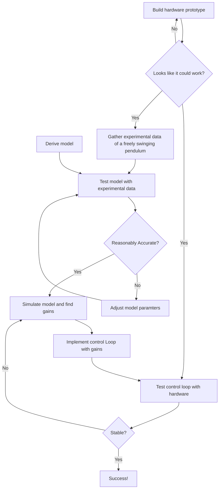

+++
date = '2025-02-24T13:15:05+13:00'
draft = false
title = 'Rotary Inverted Pendulum'
description = 'A simple prototype using a stepper motor, an Arduino Uno and a rotary encoder'
tags = ["Control Systems", "Arduino", "Embedded Systems", "Linear Quadtratic Regulator"]
layout = 'portfolio'
+++

jump to [Demonstration](#demonstration)

You can find the full documentation, hardware assembly details and software details at **[Github](https://github.com/jensen-benard/rotary-inverted-pendulum.git)**.

## Introduction
During my last semester as an undergraduate, we were given a group assignment to find suitable gains that would stabilise a linear inverted pendulum for any given position. In our case, the system was a cart on linear rails with a pendulum attached, similar to the image showed below:

We were given a state-space model of the system and used the linear quadratic regulator (LQR) method to find suitable gains through MATLAB simulations. Once we believed we found our gains, we could try them out on a real cart-pendulum system that was set up at the university.

However, despite eventually finding suitable gains as a group, I felt I didn't understand the theory enough to be able to apply it to a real-world system by myself. So, I decided to create a prototype that would allow me to do just that. I felt a rotary (rather than linear) inverted pendulum would be mechanically simpler and take up less space. However, the mathematics is more complicated due to a greater number of non-linear terms. But that's what the summer is for and I'm here to learn!

## Overview
Overall, the project workflow can be summarised into the following diagram:

## Demonstration

### Attempt #1 (State Feedback Control Loop)
<!-- Video of the rotary inverted pendulum -->

My first attempt used a direct state-feedback control loop. This means the input to the controller is the state of the system (i.e. the pendulum's and arm's angle and angular velocity). However, as you can see in the video, the arm slowly drifts away from the the target (zero angle) over time.

### Attempt #2 (State Feedback Control Loop with integral Gain)
<!-- Video of the rotary inverted pendulum -->
It's clear that the simulation model isn't completely accurate so I account for that by adding an integral gain. 

### Attempt #3 (Tracking Gain)
<!-- Video of the rotary inverted pendulum -->

So far, the previous attempts simply set a target of zero degrees for both the pendulum and arm angle. By adding a tracking gain, a target angle can be set for the arm. This gives a very cool effect as the arm follows the target angle over time, while mainting the pendulum's balance at zero degrees.
